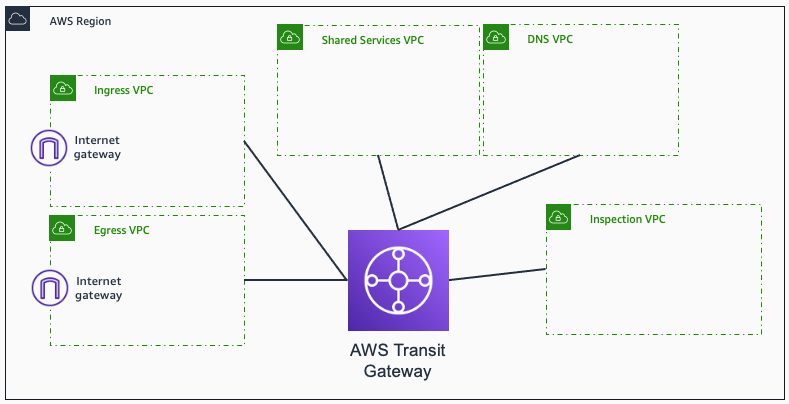
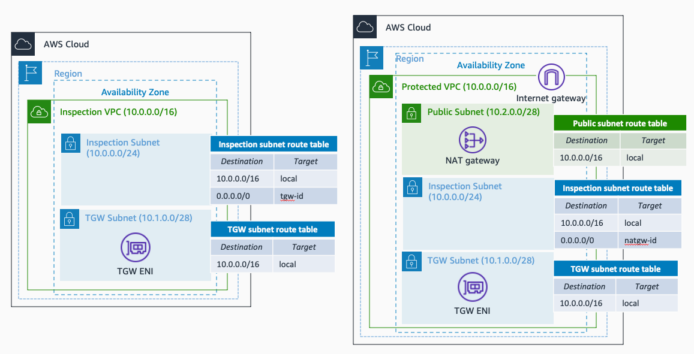
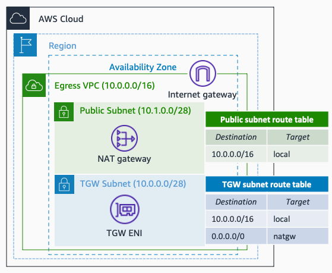
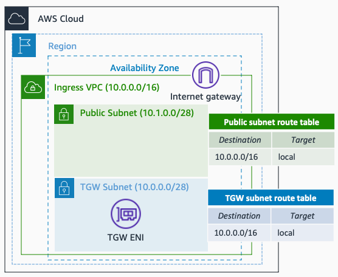
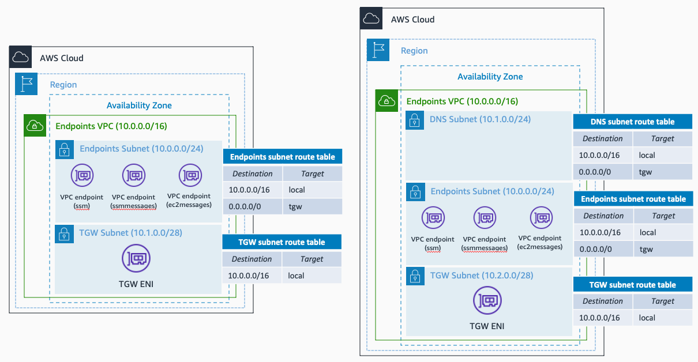
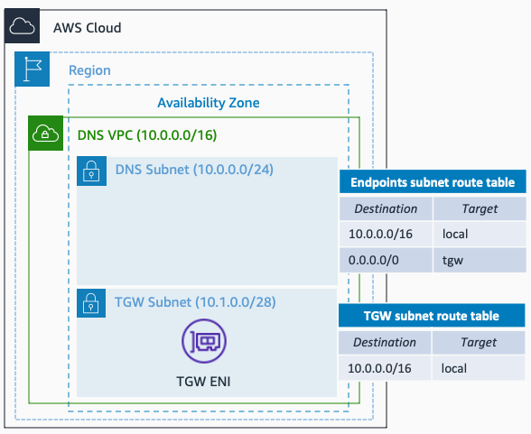
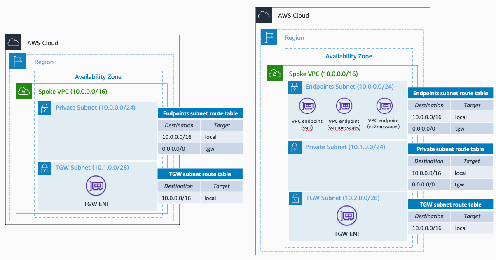

# AWS Hub and Spoke Architecture with AWS Transit Gateway - Terraform Module

[AWS Transit Gateway](https://docs.aws.amazon.com/vpc/latest/tgw/what-is-transit-gateway.html) is a network hub that you can use to interconnect your VPCs and on-premises networks. With it, you can create hub and spoke architectures to control how your VPCs and on-prem resources communicate between them (traffic segmentation). In addition, you can centralize different services - like traffic inspection or the connection to VPC endpoints - and therefore avoid extra costs by overprovisioning those services.

This Terraform module helps you create the base of your networking infrastructure in AWS, by provisioning a Hub and Spoke Architecture with AWS Transit Gateway. You can indicate which resources you want to centralize - by defining which central VPCs you want to create -, and you get the Transit Gateway, VPCs, and routing needed to achieve the interconnection. The only thing you will need to do later is place the worloads and services you want to centralize.

## Prerequisites

- An AWS account with an IAM user with the appropriate permissions
- Terraform installed

## Code Principles:

- Writing DRY (Do No Repeat Yourself) code using a modular design pattern

## Architecture

## Usage

By default, the AWS Transit Gateway is the only resource it will be created - no VPCs are created without explicitly defining it. By checking the input variables, you will see that there is one variable (*object*) per central VPC, and another one to define all the Spokes VPCs you want to create in your environment (*map(object)*). For the central VPCs, the only variable that is compulsory in the object is the *create_vpc* one, to indicate if the VPC should be created or not - by default, the value is *false*.

Note that the services to place in the VPCs (firewall endpoints, VPC endpoints, instances, etc.) are not created, leaving you the freedom to place whatever you want once the infrastructure is created. Same about IAM roles or KMS Keys, if you want to enable logging in the VPCs created, you will need to create these resources first and provide the ID/ARN in the module variables. The exceptions are NAT gateways (if egress traffic is selected) and SSM endpoints (created either centralized in the Endpoints VPC or decentralized in all the Spoke VPCs).

### Centralizing Inspection

If a central Inspection VPC is created, you need to indicate the CIDR block and the number of Availability Zones (from 1 - 3) to place the resources. The image below shows the VPC subnets and routing configuration to create when this VPC is configured without egress traffic. If the *enable_egress* variable is set to *true*, the centralization of the egress traffic is also added in this VPC - a common use case when centralizing inspection for both North-South traffic.

In both situations, the Inspection Subnets created are empty, so you can place the firewall solution you want - AWS Network Firewall endpoints or Gateway Load Balancer endpoints pointing to your 3rd-party firewall solution.

### Centralizing Egress Traffic

If a central Egress VPC is created, you need to indicate the CIDR block and the number of Availability Zones (from 1 - 3) to place the resources. The image below shows the VPC to create, with NAT gateways and Internet gateway. No extra resources are expected to be created.

**Note** that if you select the creation of an Inspection VPC with egress traffic, you won't be able to create an Egress VPC at the same time - to avoid the creation of two egress points in your environment.

### Centralizing Ingress Traffic

If a central Ingress VPC is created, you need to indicate the CIDR block and the number of Availability Zones (from 1 - 3) to place the resources. The image below shows the VPC subnets and routing configuration to create.

The Public Subnets created are empty, so you can place the ingress solution you want - either an Elastic Load Balancer (NLB, ALB) or a 3rd-party firewall you want.

### Centralizing VPC Endpoints

If a central Endpoints VPC is created, you need to indicate the CIDR block and the number of Availability Zones (from 1 - 3) to place the resources. The image below shows the VPC to create, with the SSM VPC endpoints. These VPC endpoints are created by default to follow best practices, and avoid opening SSH or RDP in your instances created in the Spoke VPCs. If the *enable_dns* variable is set to *true*, extra resources are created to place your Hybrid DNS Resolver solution - either Route 53 Resolver Endpoints or EC2 Conditional Forwarders. It is a common use case to have VPC endpoints and your hybrid DNS configuration placed in the same VPC. However you can also have them separated in different VPCs.

In addition to the resources mentioned above, if the Endpoints VPC is created, Private Hosted Zones for the SSM services are created and associated with the Spoke VPCs and the VPC where your Hybrid DNS resolution is created.

### Centralizing DNS Resolution

If a central DNS VPC is created, you need to indicate the CIDR block and the number of Availability Zones (from 1 - 3) to place your resources. The image below shows the VPC subnets and routing configuration to create.

The DNS Subnets created are empty, so you can place the DNS solution you want - either Route 53 Resolver Endpoints or EC2 DNS Forwarders.

### Spoke VPCs

You can create as many Spoke VPCs as you want, indicating the name of the VPC, the CIDR block, and the number of Availability Zones (from 1 - 3) to place your resources. The image below shows the VPC subnets and routing configuration to create.

If an Endpoints VPC is not created, and therefore there isn't VPC endpoint centralization, SSM VPC endpoints are created in each Spoke VPC (decentralized) to follow best practices. If the VPC endpoints are centralized, Private Hosted Zones for the SSM endpoints are associate with each Spoke VPC created.

### VPC Flow Logs

All the VPC configurations have the variable *enable_logging*, that creates a CloudWatch log group as a destination of VPC Flow Logs. **This module won't create** any IAM role to allow VPC Flow Logs publish the logs into CloudWatch Logs. That is why you will need to create this IAM role and pass its ARN in the input variable *log_variables*. In addition, to follow best practices, the logs should be encrypted at rest. **This module won't create** any KMS key or related IAM role to enable this encryption, and you will need to create this resources. The KMS Key needs to be passed as variable in the input *log_variables* alongside the VPC Flow Logs IAM Role.

In the *examples* section you have an example of the creation of the resources needed to allow logging - and encrypt the logs - in any of the VPCs created.
