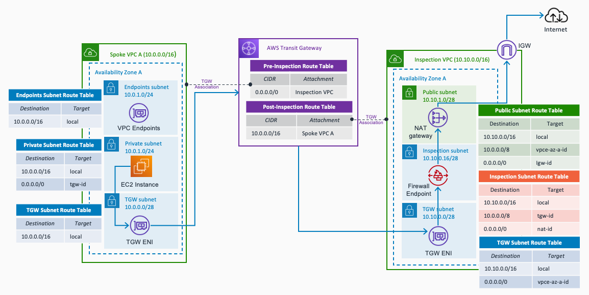

---

---

# Example: AWS Hub and Spoke with Inspection VPC (egress included) - Logging enabled

This example uses the AWS Hub and Spoke module to create a central inspection VPC with egress traffic. The resources created by the module are the following ones:

- AWS Transit Gateway, TGW attachments to the Inspection VPC and Spoke VPC, and its corresponding TGW Route Tables.
- Inspection VPC, with NAT gateway and Internet gateway - to allow egress traffic.
- Spoke VPC with SSM endpoints - decentralized VPC endpoints.
- Logging enabled (VPC Flow Logs)

The module does not create any EC2 instances, firewall solution, IAM role or KMS Key - leaving the user the freedom to configure all these resources. For you to have an example on how these resources can be created, you will see code that deploys:

- AWS Network Firewall - endpoints added in the Inspeciton VPC, and Strict Rule Ordering configuration.
  - Stateless rule group to block any SSH or RDP traffic.
  - Statefull rule groups allowing ICMP and some domain names (example.com for HTTP and amazon.com for HTTPS)
- EC2 instances in the Spoke VPC, and IAM role and Security Group to allow SSM access.
- IAM role to enable VPC Flow Logs with CloudWatch log groups as destination.
- KMS Key to encrypt all the CloudWatch Log Groups (it's a best practice to encrypt the logs at rest)

## Prerequisites

- An AWS account with an IAM user with the appropriate permissions
- Terraform installed

## Code Principles:

- Writing DRY (Do No Repeat Yourself) code using a modular design pattern

## Usage

- Clone the repository
- Edit the variables.tf file in the project root directory. This file contains the variables that are used to configure the VPCs to create, and Hybrid DNS configuration needed to work with your environment.
- To change the configuration about the Security Groups and VPC endpoints to create, edit the locals.tf file in the project root directory
- Initialize Terraform using `terraform init`
- Deploy the template using `terraform apply`

**Note** The default number of Availability Zones to use in the Spoke VPCs is 1. To follow best practices, each resource - EC2 instances, NAT gateways, and Network Firewall endpoints - will be created in each Availability Zone. **Keep this in mind** to avoid extra costs unless you are happy to deploy more resources and accept additional costs.

<!-- BEGIN_TF_DOCS -->
## Requirements

| Name | Version |
|------|---------|
|  [terraform](#requirement\_terraform) | 1.1.4 |
|  [aws](#requirement\_aws) | 3.73.0 |

## Providers

| Name | Version |
|------|---------|
|  [aws](#provider\_aws) | 3.73.0 |

## Modules

| Name | Source | Version |
|------|--------|---------|
|  [central\_inspection](#module\_central\_inspection) | ../.. | n/a |
|  [compute](#module\_compute) | ./modules/compute | n/a |
|  [iam\_kms](#module\_iam\_kms) | ./modules/iam_kms | n/a |

## Inputs

| Name | Description | Type | Default | Required |
|------|-------------|------|---------|:--------:|
|  [aws\_region](#input\_aws\_region) | AWS Region to create the environment. | `string` | `"eu-west-1"` | yes |
|  [cidr\_blocks](#input\_cidr\_blocks) | CIDR blocks to use in the different VPCs to create | `any` | <pre>{   "inspection_vpc": "10.10.0.0/16",   "spoke_vpcs": {     "spoke_1": "10.0.0.0/16"   } }</pre> | yes |
|  [identifier](#input\_identifier) | Project identifier | `string` | `"hub-spoke-inspection"` | yes |
|  [instance\_type](#input\_instance\_type) | Instance type to use in the EC2 instances. | `string` | `"t2.micro"` | yes |
|  [number\_azs](#input\_number\_azs) | Number of AZs - to indicate in all the VPCs created | `number` | `2` | yes |

## Outputs

| Name | Description |
|------|-------------|
|  [ec2\_instances](#output\_ec2\_instances) | EC2 instances created. |
|  [inspection\_vpc](#output\_inspection\_vpc) | VPC ID of the Inspection VPC. |
|  [network\_firewall](#output\_network\_firewall) | AWS Network Firewall ID. |
|  [spoke\_vpcs](#output\_spoke\_vpcs) | VPC IDs of the Spoke VPCs. |
|  [transit\_gateway](#output\_transit\_gateway) | AWS Transit Gateway ID. |
|  [vpc\_endpoints](#output\_vpc\_endpoints) | Interface VPC endpoints created. |
<!-- END_TF_DOCS -->